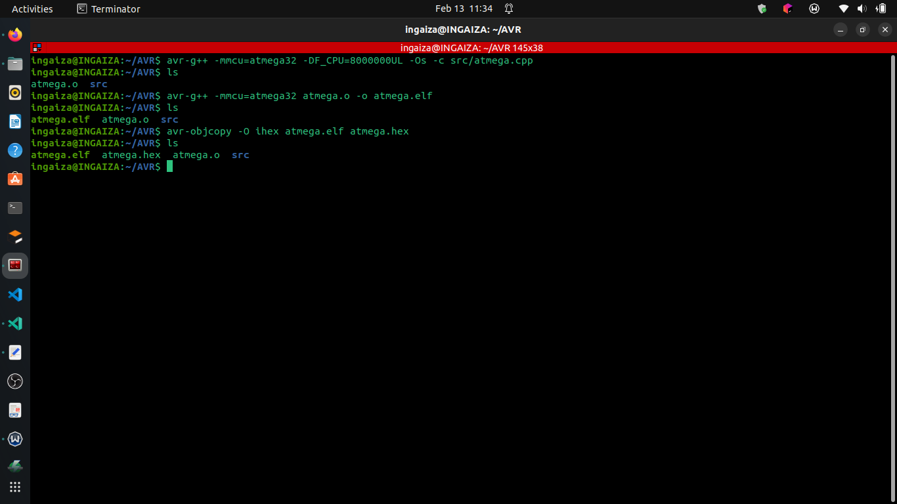

# Atmega32
A simple AVR ATMEGA32 program to blink an LED

## Task:
* Blink an LED every second
* When a button is pressed , LED should stay on until is released
* LED should be connected to pin 13 and Button to Pin 2

## Optional enhancements
* Use Interrupts 
* Implement Software debounce

## IMPLEMENTATION
The task has been implemented for the AVR ATMEGA32 microcontroller and written in C++ using the avr libraries.
In the instructions, LED is to be placed on PIN 13 but in the ATMEGA32 PIN 13 is not a general purpose I/O pin hence cannot be used, as for the Button, It was to be placed in PIN 2 but since I'm using Hardware Interrupt , in the ATMEGA32 you are constrained to only 3 pins: INT0(PIN 16), INT1(PIN 17) & , INT2(PIN 3).Hence choosing INT0.


The main function Initialized PORTB PIN B7 (PIN 8) as an output pin for the LED through the Data Direction Register DDRB

```cpp
int main()
{
    //Initializing Port B Pin 7 as an Output PIN
    DDRB |= (1<<PB7);
    //Setup interrupt
    interrupt_init();

    while(1)
    {
        if(!button_press)
        {
            PORTB ^= (1<<PB7);
            _delay_ms(1000);
        }
    }
}
```

Next in the main the interrupt_init() function is called to setup the interrupts

```cpp
void interrupt_init()
{
    // Setup PORTD INT0(PIN D2) as an Input
    DDRD &= ~(1<<PD2);
    // Activating Internal Pullup resistor for a normaly high logic
    PORTD |= (1<<PD2);
    // Enable INT0 Interrupt Service in the GICR register
    GICR |= (1<<INT0);
    // Set up INT0 as edge triggered in the MCUCR Register
    MCUCR = 0x01;
    // enable interrupts
    sei();
}
```
		
In the interrupt_init() function first PORTD PIN D2 is set as an input for the Button connection
```cpp
DDRD &= ~(1<<PD2);
```

Since the button is connected to the ground the Pin pullup resistor is activated for a normaly high logic
```cpp
PORTD |= (1<<PD2);
```

Next step is to enable the INT0 interrupt using the General Interrupt Control Register
```cpp
GICR |= (1<<INT0);
```

INT0 is set up as edge triggered meaning it will be responsive to logic changes from high to low and from low to high.
```cpp
MCUCR = 0x01;
```

Lastly interrupts are enabled by
```cpp
sei();
```
		 
Upon return to the main function, it enters an infinite while loop that Toggles the state of PIN B7 upon checking if button_press variable is false.
Declarations: 
```cpp
volatile uint8_t button_press = 0;
volatile uint8_t debounce;	
```

After toggling a delay of 1 second (1000ms) is started.
```cpp
if(!button_press)
{
    PORTB ^= (1<<PB7);
    _delay_ms(1000);
}
```
	
Upon a button press the Interrupt Service Routine function is called.

```cpp
ISR(INT0_vect)
{
    _delay_ms(20); // debounce delay
    // read status of PORT D 
    debounce = PIND;
    // Mask status of PD2
    debounce &= 0b00000100;

    // Verify PD2 status by comparing it to expected status according to ISR(last state)
    if(!button_press)
    {
        if(debounce == 0)
        {
            button_press = !button_press;
            if(button_press)
            {
                PORTB |= (1<<PB7); // set PIN7 to high 
            }
            else PORTB &= ~(1<<PB7);
        }
       
    }
    else
    {
        if(debounce == 0b00000100)
        {
            button_press = !button_press;
            if(button_press)
            {
                PORTB |= (1<<PB7); // set PIN7 to high 
            }
            else PORTB &= ~(1<<PB7);
        }
    }
} 
```
		
In the ISR function when a button is pressed it toggles the state of button_press i.e from low to high 0 to 1.
```cpp
button_press = !button_press;
if(button_press)
{
    PORTB |= (1<<PB7); // set PIN7 to high 
}
else PORTB &= ~(1<<PB7); 
```
		    
Next , if the button_press is true i.e valid/ not zero , PORTB PIN B7 is set to high if false it is set to LOW
The debounce logic is implemented by comparing the initial/expected state of the pin to the current state after a debounce delay.
The Initial/expected state varies depending on the status of the button press:
* when the button is pressed, ISR function is called meaning a logic change from high to low has been detected, therefore the expected logic level for the pin is LOW, this becomes the initial state.After the debounce delay, PIN D2(INT0) is read for its status and recorded as the current state in the debounce variable.Therefore debounce is compared to the initial state to verify the state. 
* when the button is released, ISR function is called meaning a logic change from low to high has been detected, therefore the expected logic level for thte pin is HIGH, the becomes the initial state.Similarly, after the debounce delay PIN D2(INT0) is read for its current status.Afterwhich it is compared with the initial state to verify the state.


